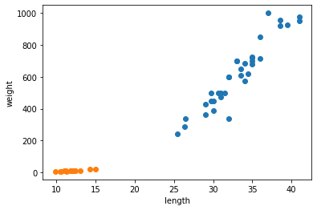

#**나중에 찾아볼 것**

- 파이썬 연산자 오버로딩

## **머신러닝** : 규칙을 프로그래밍하지 않아도 자동으로 데이터에서 규칙을 학습하는 알고리즘을 연구하는 분야

## **딥러닝** : 머신러닝 알고리즘 중에 인공신경망을 기반으로 한 방법들의 통칭

**클래스(class)** : 구별할 데이터의 종류?  
**분류(classification)** : 여러 개의 클래스 중 하나를 구별해 내는 문제  
**이진 분류(binary classification)** : 2개의 클래스 중 하나를 고르는 문제

```python
# 도미 데이터, 특성(길이, 무게)
bream_length = [25.4, 26.3, 26.5, 29.0, 29.0, 29.7, 29.7, 30.0, 30.0, 30.7, 31.0, 31.0,
                31.5, 32.0, 32.0, 32.0, 33.0, 33.0, 33.5, 33.5, 34.0, 34.0, 34.5, 35.0,
                35.0, 35.0, 35.0, 36.0, 36.0, 37.0, 38.5, 38.5, 39.5, 41.0, 41.0]
bream_weight = [242.0, 290.0, 340.0, 363.0, 430.0, 450.0, 500.0, 390.0, 450.0, 500.0, 475.0, 500.0,
                500.0, 340.0, 600.0, 600.0, 700.0, 700.0, 610.0, 650.0, 575.0, 685.0, 620.0, 680.0,
                700.0, 725.0, 720.0, 714.0, 850.0, 1000.0, 920.0, 955.0, 925.0, 975.0, 950.0]
```

특성(feature) : 데이터를 표현하는 하나의 성질

```python
import matplotlib.pyplot as plt

plt.scatter(bream_length, bream_weight)
plt.xlabel('length')
plt.ylabel('weight')
plt.show()
```


산점도 그래프가 일직선에 가까운 형태로 나타나는 경우 **선형(linear)**적이라고 말함.

```python
# 빙어 데이터
smelt_length = [9.8, 10.5, 10.6, 11.0, 11.2, 11.3, 11.8, 11.8, 12.0, 12.2, 12.4, 13.0, 14.3, 15.0]
smelt_weight = [6.7, 7.5, 7.0, 9.7, 9.8, 8.7, 10.0, 9.9, 9.8, 12.2, 13.4, 12.2, 19.7, 19.9]
```

```python
plt.scatter(bream_length, bream_weight)
plt.scatter(smelt_length, smelt_weight)
plt.xlabel('length')
plt.ylabel('weight')
plt.show()
```



```python
# 데이터를 학습시키기 전에 전처리
length = bream_length + smelt_length
weight = bream_weight + smelt_weight
fish_data = [[l, w] for l, w in zip(length, weight)]
print(fish_data)
```

    [[25.4, 242.0], [26.3, 290.0], [26.5, 340.0], [29.0, 363.0], [29.0, 430.0], [29.7, 450.0], [29.7, 500.0], [30.0, 390.0], [30.0, 450.0], [30.7, 500.0], [31.0, 475.0], [31.0, 500.0], [31.5, 500.0], [32.0, 340.0], [32.0, 600.0], [32.0, 600.0], [33.0, 700.0], [33.0, 700.0], [33.5, 610.0], [33.5, 650.0], [34.0, 575.0], [34.0, 685.0], [34.5, 620.0], [35.0, 680.0], [35.0, 700.0], [35.0, 725.0], [35.0, 720.0], [36.0, 714.0], [36.0, 850.0], [37.0, 1000.0], [38.5, 920.0], [38.5, 955.0], [39.5, 925.0], [41.0, 975.0], [41.0, 950.0], [9.8, 6.7], [10.5, 7.5], [10.6, 7.0], [11.0, 9.7], [11.2, 9.8], [11.3, 8.7], [11.8, 10.0], [11.8, 9.9], [12.0, 9.8], [12.2, 12.2], [12.4, 13.4], [13.0, 12.2], [14.3, 19.7], [15.0, 19.9]]

사이킷런에서 데이터를 학습시킬려면 2차원 리스트를 만들어야함.

```python
# 정답 데이터 준비
fish_target = [1] * 35 + [0] * 14
print(fish_target)
```

    [1, 1, 1, 1, 1, 1, 1, 1, 1, 1, 1, 1, 1, 1, 1, 1, 1, 1, 1, 1, 1, 1, 1, 1, 1, 1, 1, 1, 1, 1, 1, 1, 1, 1, 1, 0, 0, 0, 0, 0, 0, 0, 0, 0, 0, 0, 0, 0, 0]

데이터를 보고 구분할만한 **규칙을 찾기 위해서는 정답 데이터**가 필요함.(상식적으로😏)

```python
from sklearn.neighbors import KNeighborsClassifier

kn = KNeighborsClassifier()
kn.fit(fish_data, fish_target) # 훈련
kn.score(fish_data, fish_target) # 평가, 잘못된 평가이다(스포일러ㅋ)
# 반환된 이 값을 정확도(accuracy)라고 부름.
```

    1.0

**훈련** : 데이터에서 규칙을 찾는 과정

**모델(model)**

- 알고리즘이 구현된 객체, 알고리즘 자체
- 머신러닝 알고리즘을 구현한 프로그램
- 프로그램이 아니더라도 알고리즘을 (수식 등으로) 구체화하여 표현한 것

# **K-최근접 이웃 알고리즘(K-Nearest Neighbors)**

어떤 데이터에 대한 답을 구할 때 주변에서 가장 가까운 몇개의 데이터를 보고 다수를 차지하는 것을 정답으로 사용하는 알고리즘

```python
# 어떤 데이터를 예측해보기
kn.predict([[30, 600]])
```

    array([1])

predict() 메서드는 새로운 데이터의 정답을 예측함.

이렇게 생각하면 K-최근접 이웃 알고리즘을 위해 준비해야 할 일은  
**데이터를 모두 가지고 있는게 전부**다. 새로운 데이터에 대해 예측할 때는 가장 가까운  
직선거리에 어떤 데이터가 있는지를 살피기만 하면 됨. 따라서  
**데이터가 아주 많은 경우 사용하기 어렵다!**

```python
# KNN은 전달한 데이터를 모두 가지고 있음.
print(kn._fit_X)
print(kn._y)
```

    [[  25.4  242. ]
     [  26.3  290. ]
     [  26.5  340. ]
     [  29.   363. ]
     [  29.   430. ]
     [  29.7  450. ]
     [  29.7  500. ]
     [  30.   390. ]
     [  30.   450. ]
     [  30.7  500. ]
     [  31.   475. ]
     [  31.   500. ]
     [  31.5  500. ]
     [  32.   340. ]
     [  32.   600. ]
     [  32.   600. ]
     [  33.   700. ]
     [  33.   700. ]
     [  33.5  610. ]
     [  33.5  650. ]
     [  34.   575. ]
     [  34.   685. ]
     [  34.5  620. ]
     [  35.   680. ]
     [  35.   700. ]
     [  35.   725. ]
     [  35.   720. ]
     [  36.   714. ]
     [  36.   850. ]
     [  37.  1000. ]
     [  38.5  920. ]
     [  38.5  955. ]
     [  39.5  925. ]
     [  41.   975. ]
     [  41.   950. ]
     [   9.8    6.7]
     [  10.5    7.5]
     [  10.6    7. ]
     [  11.     9.7]
     [  11.2    9.8]
     [  11.3    8.7]
     [  11.8   10. ]
     [  11.8    9.9]
     [  12.     9.8]
     [  12.2   12.2]
     [  12.4   13.4]
     [  13.    12.2]
     [  14.3   19.7]
     [  15.    19.9]]
    [1 1 1 1 1 1 1 1 1 1 1 1 1 1 1 1 1 1 1 1 1 1 1 1 1 1 1 1 1 1 1 1 1 1 1 0 0
     0 0 0 0 0 0 0 0 0 0 0 0]

새로운 데이터에 대해 예측할 때는 가장 가까운
직선거리에 어떤 데이터가 있는지를 살피기만 하면 된다.  
그렇다면 가까운 몇 개의 어떤 데이터를 참고할까?  
KNeighborsClassifier 클래스의 기본값은 5이다.  
이 기준은 n_neighbors 매개변수를 통해 바꿀 수 있음.  
ex)

```
kn49 = KNeighborsClassifier(n_neighbors=49)
```

가장 가까운 직선거리를 재는 방법은 p 매개변수로 지정함.  
p=1 : 맨해튼 거리, p=2 : 유클리디안 거리(기본값).  
n_jobs 매개변수로 사용할 CPU코어를 지정.(fit()에는 영향 없음)  
n_jobs=-1 : 모든 코어 사용 (기본값은 1)

```python
# 모든 생선을 참고하여 예측하는데 도미 데이터가 35개로 다수를 차지함.
# 따라서 어떤 데이터를 넣어도 무조건 도미!!!
kn49 = KNeighborsClassifier(n_neighbors=49)
kn49.fit(fish_data, fish_target)
print(kn49.score(fish_data, fish_target) )
print(35/49) # 49개중 35개만 맞춘거
```

    0.7142857142857143
    0.7142857142857143
