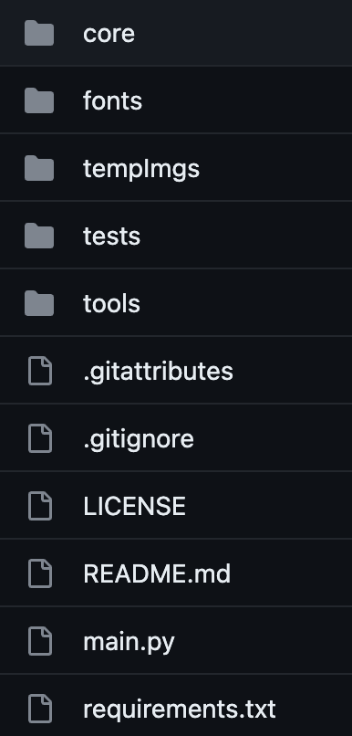

# 이모티콘을 만들어주는 카카오톡 챗봇 만들기

[이모티꼰 깃허브 레포지토리](https://github.com/sonG1031/emotiKkon)에서 시현 영상을 볼 수 있다!
{: .notice--info}

## 개발 동기

바야흐로 내가 회사를 다닐때였다.  
회사에는 쉬는시간이 따로 존재하지 않아서 공부를 지치기 직전까지 했었다.  
그렇게 지친 후에 나는 다른 회사로 간 친구와 카톡을 주고 받으며 소소한 행복을 느꼈다.  
그런 일상이 반복되는 와중 이모티콘을 쓰려다 우연히 이모티콘샵을 들어가게 되었다.  
거기서 인기 이모티콘 랭킹을 확인하게 되었는데 그중에서 눈을 뗄 수 없는 아름다운 이모티콘을 발견하게 되었다.

그것은 바로 문상훈 짤 모음 2!!
{: .text-center}
  
{: .align-center}
{: .align-center}
첫눈에 반해버린 나는 결제를 속행하였고 덕분에 내 친구들은 한동안 문상훈과 대화를 할 수 있었다ㅎㅎ  
그렇게 또 그런 일상이 반복되는 와중에 머리에 전구가 들어오게 된다.  
내 친구들은 엄청난 재능을 가지고 있는데 바로 문상훈 보다 아름다운 비주얼이라고 할 수 있다.  
이런 친구들의 사진들로 문상훈 짤과 비슷한 이모티콘을 간편하게 만들 수 있다면 얼마나 아름다울까?!  
그래서 나는 카톡으로 채팅을 주고 받다가 가장 간편하게 이모티콘을 만들 수 있도록 카카오톡 챗봇을 유저 인터페이스로 만들기로 다짐한다!

앞으로 이모티콘을 이모티꼰이라고 부를테니 헷갈리지 마세요!
{: .text-center}
{: .notice--warning}

## 개발에 사용한 것

- 카카오 iBuilder
  - 카카오톡 챗봇을 만들 수 있는 공식 [사이트](https://chatbot.kakao.com/)이다.
- [FastAPI](https://fastapi.tiangolo.com/)
  - Python을 사용하여 비동기 방식으로 동작하는 API를 만들 수 있는 프레임워크다.
  - 챗봇에 원하는 기능을 구현하기 위해 API를 만들어야 했다.
- [Pillow(PIL)](https://pillow.readthedocs.io/)
  - Python Imaging Library의 약자로, Python으로 이미지를 다룰 때 유용한 기능들을 제공하는 라이브러리이다.
  - 챗봇이 API에 보낸 이미지를 가공하기 위해서 사용했다.
- [Imgur API](https://apidocs.imgur.com/)
  - 무료 이미지 호스팅 사이트이다!
  - 챗봇이 사용자에게 완성된 이모티꼰을 보여줘야 했는데,  
    보여주는 방법이 API에서 이미지 파일을 전송하는 것이 아니라 이미지 링크를 챗봇에 보내주는 것이였다.  
    따라서 완성된 이모티꼰을 imgur에 호스팅한 링크로 챗봇에게 주기 위해 사용했다.
- [Cloudtype](https://cloudtype.io/)
  - 무료 서버 호스팅 서비스이다. (근데 딱 무료만큼의 성능)
  - API를 로컬 환경이 아닌 챗봇이 접근할 수 있도록 해주기 위해 사용했다.

## 구현

코드를 A~Z까지 설명하기에는 무리라고 판단한다.  
그래서 코드를 혼자서도 이해할 수 있도록 프로젝트 구조와 핵심 로직만 설명하겠다.  
오픈소스이므로 [내 깃허브 레포지토리](https://github.com/sonG1031/emotiKkon)를 통해 설명하지 못한 부분을 스스로 느껴보자.

#### 프로젝트 구조

프로젝트 구조는 아래와 같다.
{: .text-center}
{: .align-center .img-width-half}

- core
  - 코드에 전체적으로 쓰이는 공통적인 것들을 모아둔 폴더이다.
  - 그러나 프로젝트가 크지 않아 imgur API를 사용하기 위한 client_id, client_secret가 전부다.
- fonts
  - 이미지에 삽입할 글의 폰트를 저장한 폴더이다.
- tempImgs
  - 이미지를 임시 저장하는 폴더이다.
  - imgur로 이미지를 호스팅하기 위해서 이미지를 저장한 후 그 경로로 파일을 전송하기 때문에 임시 저장 공간을 만들게 되었다.
- tests
  - tools 폴더에 있는 모듈들을 테스트 하기 위한 코드를 저장한 폴더이다.
- tools
  - API에 사용되는 메인/서브 로직들을 모아둔 폴더이다.
- main.py
  - API를 동작하게 하는 코드가 작성되어 있다.
  - 프로젝트 규모가 작아서 하나의 스크립트로도 충분했다.

#### 핵심 로직

```python
class HandleImg:
    # 작업에 필요한 변수 세팅
    __fontsize = 1
    __row_img_fraction = 0.8  # 이미지에 차지할 정도 가로
    __col_img_fraction = 0.1 # 이미지에 차지할 정도 세로
    __font_path = "/app/fonts/SUITE-SemiBold.ttf" # cloudtype 환경
    __font = ImageFont.truetype(__font_path, __fontsize)
    __textX = 0
    __textY = 0

    def __init__(self, text, file, align: dict[str, str]=None):
        if align is None:
            self.align = {'row': 'center', 'col': 'bottom'}
        else:
            self.align = align
        self.text = text
        # url를 통해 이미지를 얻어온다.
        self.img_pil = Image.open(requests.get(file, stream=True).raw)
        # 얻어온 이미지를 가공하기 위한 handler같은 역할이다.
        self.draw = ImageDraw.Draw(self.img_pil, 'RGBA')
```

이 코드는 HandleImg 클래스의 변수 부분이다.  
HandleImg 클래스는 이미지에 글을 넣어주는 기능을 담고 있는 클래스이다.

- row_img_fraction, col_img_fraction
  - 주석에 나와있든 이미지에 차지할 정도를 나타낸다.
  - 예를 들어 0.5이면 50% 만큼만 이미지에 채운다는 소리다.
- textX, textY
  - 삽입할 텍스트의 X, Y 좌표이다.

여기서 궁금할거다. 왜 이미지에 차지할 정도를 신경쓰는거지?  
사실 이미지에 글을 이모티꼰을 만드는게 쉬워보여도 약간 정교한 작업이 필요하다.  
그것은 바로 이미지 크기에 맞춰 글자 크기가 동적으로 변해야한다.  
그래야 사용자가 어떤 길이의 글을 입력해도 이미지에 맞춰서 이모티꼰이 아릅답게 생성되니깐!

```python
    async def __set_fontsize(self):
        row_end = self.__row_img_fraction * self.img_pil.size[0]
        col_end = self.__col_img_fraction * self.img_pil.size[1]
        jumpsize = 75
        while True:
            if self.__font.getbbox(self.text)[2] < row_end and self.__font.getbbox(self.text)[3] < col_end:
                self.__fontsize += jumpsize
            else:
                jumpsize = jumpsize // 2
                self.__fontsize -= jumpsize
            self.__font = ImageFont.truetype(self.__font_path, self.__fontsize)
            if jumpsize <= 1:
                break
```

위 메서드가 바로 이미지에 맞게 글의 크기를 정해준다.  
row_end, col_end는 이미지의 가로, 세로 크기를 차지할 정도만큼의 크기로 줄인 값이다.  
jumpsize는 글의 크기를 몇만큼 증가시킬지에 대한 값이다.  
무한 반복문부터의 로직은 이진 검색(글의 크기를 기준)을 통해 글의 크기를 찾는다.

font에 대한 정보를 제공하는 클래스를 담은 \_\_font 변수를 통해 getbbox 메서드로 바운딩 박스의 좌표를 알려준다.
{: .notice--info}

이렇게 글의 크기를 구하고 나면 삽입할 글의 좌표를 정렬한다.

```python
    async def __align_text(self):
        _, _, w, h = self.draw.textbbox((0, 0), self.text, font=self.__font)
        row_padding = self.img_pil.size[0] * 0.05
        col_padding = self.img_pil.size[1] * 0.05

        if self.align['row'] == 'center':
            self.__textX = (self.img_pil.size[0] - w) / 2
        elif self.align['row'] == 'right':
            self.__textX = self.img_pil.size[0] - w - row_padding
        elif self.align['row'] == 'left':
            self.__textX = 0 + row_padding

        if self.align['col'] == 'mid':
            self.__textY = (self.img_pil.size[1] - h) / 2
        elif self.align['col'] == 'bottom':
            self.__textY = self.img_pil.size[1] - h - col_padding
        elif self.align['col'] == 'top':
            self.__textY = 0
```

위 메서드가 정렬된 X,Y좌표를 구해준다.

- row_padding, col_padding
  - 정렬 후 글이 이미지 외곽선에 붙는 걸 방지하고자 이미지의 크기의 5% 정도를 패딩값으로 넣었다.

메서드의 첫번째 줄은 삽입할 글의 바운딩 박스 좌표의 값으로 글의 가로, 세로 크기를 얻은 것이다.  
그 아래 조건문은 조건에 맞게 정렬(가로, 세로)을 계산을 통해 정렬해준다.

정렬 기능을 조건문을 통해 9가지의 경우로 만들었지만 편의를 위해 보편적인 정렬 하나만 실제 프로젝트에 적용했다.
{: .notice--info}

자 그다음은 글 뒤의 배경 삽입이다.  
이미지가 밝아서 글이 안보일 수 있고, 문상훈 이모티꼰이 글 뒤에 검은 배경이 있기에 꼭 필요한 기능이다.  
그리고 이 배경 삽입은 글 삽입보다 먼저 선행되어야 한다.  
그 이유는 글을 먼저 삽입한 후 배경을 삽입하면 글이 덮어 씌어지기 때문이다.

```python
    async def __add_background(self):
        box_color_RGBA = (0, 0, 0, 255)
        fill_color_RGBA = (0, 0, 0, 255)

        # 배경 좌표
        l, t, r, b = self.draw.textbbox((self.__textX, self.__textY), self.text, font=self.__font)  # (left,top,right,bottom)

        # 패딩 작업
        bbox_row_padding = r * 0.02
        bbox_col_padding = r * 0.02
        l = l - bbox_row_padding
        r = r + bbox_row_padding
        t = t - bbox_col_padding
        b = b + bbox_col_padding

        self.draw.rectangle((l, t, r, b), outline=box_color_RGBA, fill=fill_color_RGBA) # 배경 그리기
```

위 메서드가 배경을 삽입해준다.

- bbox_row_padding, bbox_col_padding
  - self.draw.textbbox를 통해 얻은 바운딩 박스 좌표가 글 크기에 딱 맞춰 있기 때문에 적절한 패딩을 주기 위해
    이미지의 2% 정도의 크기를 패딩값으로 만들었다.

이제 글을 삽입하면 이모티꼰 제작은 끝이난다!

```python
    async def __put_text(self):
        self.draw.text((self.__textX, self.__textY), self.text, (255, 255, 255), font=self.__font)
```

위의 메서드가 폰트 및 크기, 정렬한 좌표에 맞게 글을 이미지에 넣어준다.  
이렇게 기능별로 나눈 메서드들을 로직에 맞게 호출하여 이모티꼰을 완성해주는 메서드가 최종적으로 main.py에 쓰이게 된다.

```python
    async def make_emotikkon(self, bg: bool=False):
        await self.__set_fontsize()
        await self.__align_text()

        if bg:
            await self.__add_background()

        await self.__put_text()
        return self.img_pil
```

## 마무리

이렇게 글을 쓰고 나니 사실 그렇게 설명할 양이 많지 않다는 걸 체감했다.  
여기서 코드 3개만 더 보여주면 이 프로젝트의 로직은 완성이다ㅋㅋㅋㅋㅋㅋ  
그러나 이건 이 글을 읽는 독자의 역량 발전을 위해 숙제 느낌으로 남겨두겠다!  
여기까지 읽어줘서 정말 고맙고 같이 재밌는 것을 개발하고 공감할 수 있는 사람이 되었으면 좋겠다.  
이 프로젝트는 카카오톡 API에 맞춰 FastAPI의 구조를 완성했기에 다른 프로젝트에서 이 코드를 재사용할려면
약간의 변경이 필요하다. HandleImg 클래스의 메서드는 전혀 변경하지 않아도 되고 \_\_init\_\_에서
이미지를 가져오는 방법과 클라이언트의 요청을 처리하는 부분만 손보면 이 코드는 너의 것이다!

## [이모티꼰 깃허브 레포지토리](https://github.com/sonG1031/emotiKkon)

이 오픈소스가 재밌는 개발에 도움이 되기를🙏
